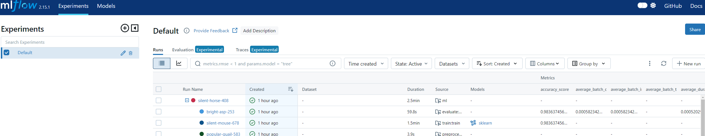
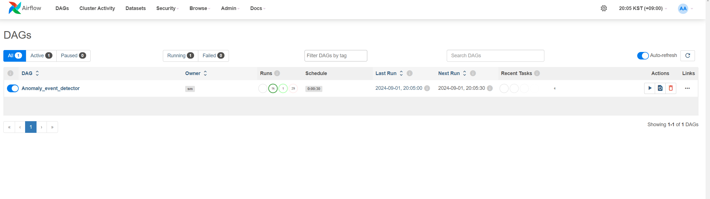

# Machine Failure Detection System
### 전체 구조도


## 실행순서
---
### 데이터 생성 단계
data-generator
- 데이터 소스 : https://www.kaggle.com/competitions/playground-series-s3e17/overvie
- data_generator.py 에서 1초마다 랜덤하게 Postgres-db로 데이터 전송
  ```bash
  # Defalut Setting
  postgres-server:
    image: postgres:14.0
    container_name: postgres-server
    ports:
      - 5432:5432
    environment:
      POSTGRES_USER: admin
      POSTGRES_PASSWORD: 1234
      POSTGRES_DB: machinedb
  ```
- Docker compose를 통해 실행
```bash
docker compose up -d
```
---
### Mlflow 셋업
mlflow-store
- mlflow backend store - postgres-server
- mlflow-artifact-store - minio storage
- mlflow-server - Python=3.10 (Docker)
- Docker compose를 통해 실행
```bash
docker compose up -d
```
- postgres-backend-store : localhost:5433
- minio console : localhost:9001
- mlflow ui : localhost:5001
- mlflow server에 데이티 전처리, 학습 모델, 평가 결과를 저장, 추적한다.
- 
### 모델 훈련 및 평가 단계
```bash
cd machine_detector/ml
```
- Mlproject를 실행하여 모델 훈련 및 평가 파이프라인 실행
- 가상환경을 준비하고, 아래 명령어 실행
```bash
# conda create -n venv python=3.10
# conda activate venv
make build-dev
```
- Mlproject는 docker-env를 통해 실행
- 실행환경 준비를 위한 도커 이미지 생성
```bash
make build-env
```
- 모델 학습 및 평가 수행
- 모델 학습 파이프라인을 실행하기 이전에 .env 파일 준비
```
#.env

MLFLOW_S3_ENDPOINT_URL = "http://localhost:9000"
MLFLOW_TRACKING_URI = "http://localhost:5001"
AWS_ACCESS_KEY_ID = "minio"
AWS_SECRET_ACCESS_KEY = "miniostorage"

POSTGRES_USER = "admin"
POSTGRES_PASSWORD = "1234"
POSTGRES_PORT = "5432"
POSTGRES_DB = "machinedb"
POSTGRES_SERVER = "localhost"
```

```bash
make run-train

# Mlproject
name: machine_detector

entry_points:
  main:
    parameters:
      preprocess_data: {type: string, default: machine}
      preprocess_fetch: {type: string, default: local}
      preprocess_downstream: {type: string, default: /opt/data/preprocess/}
      preprocess_cached_data_id: {type: string, default: ""}
      train_downstream: {type: string, default: /opt/data/model/}
      train_model_type: {type: string, default: rf}
      train_cv_type: {type: string, default: strat_cv}
      train_n_split: {type: int, default: 5}
      train_n_trials: {type: int, default: 2}
      evaluate_downstream: {type: string, default: /opt/data/evaluate/}

    command: |
      python -m main \
        --preprocess_data {preprocess_data} \
        --preprocess_fetch {preprocess_fetch} \
        --preprocess_downstream {preprocess_downstream} \
        --preprocess_cached_data_id {preprocess_cached_data_id} \
        --train_downstream {train_downstream} \
        --train_model_type {train_model_type} \
        --train_cv_type {train_cv_type} \
        --train_n_split {train_n_split} \
        --train_n_trials {train_n_trials} \
        --evaluate_downstream {evaluate_downstream}
```
- preprocess -> train -> evaluate 실행
- preprocess 단계, preprocess_fetch : local 또는 db 세팅을 통해 데이터 수집
- local -> /ml/data/raw/total_data.csv 를 사용
- db -> data-generator에서 수집되는 postgres-server에서 수집하여 사용

#### Mlflow Result
  
- 모델 전처리부터 훈련, 평가까지 수행하여  inference 시간 및 평가지표 계산


#### Minio Storage


### 추론 서버 빌드
- 훈련이 완료되면 /machine_detector/model 경로에 모델 파일이 생성된다.
- 해당 모델파일을 이미지에 넣어 서버를 배포한다.
```bash
$ cd machine_detector
$ docker compose up -d
```


### Detection Scheduler

- 먼저 진단 결과를 저장할 event db server 서버 실행
```bash
cd detection-scheduler
docker compose -f event-docker-compose.yaml up -d
```
- 이후 에어플로우 셋업
```bash
echo -e "AIRFLOW_UID=$(id -u)" > .env
```
```bash
docker compose up airflow-init
```
```bash
docker compose up -d
```
- 매 30초마다 마지막 시점부터 추론서버에 데이터 전송 및 추론 결과를 Event-server에 저장




