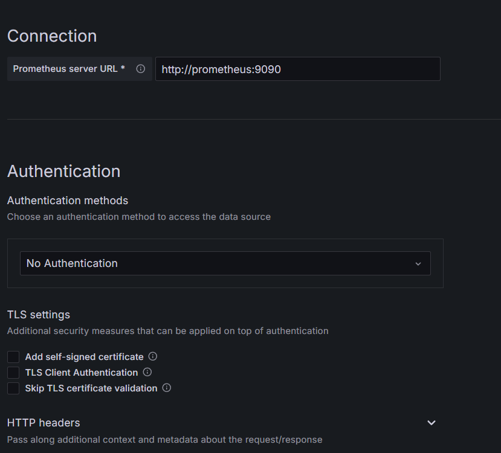
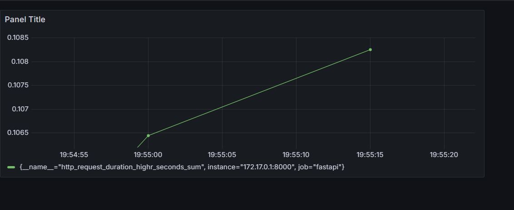
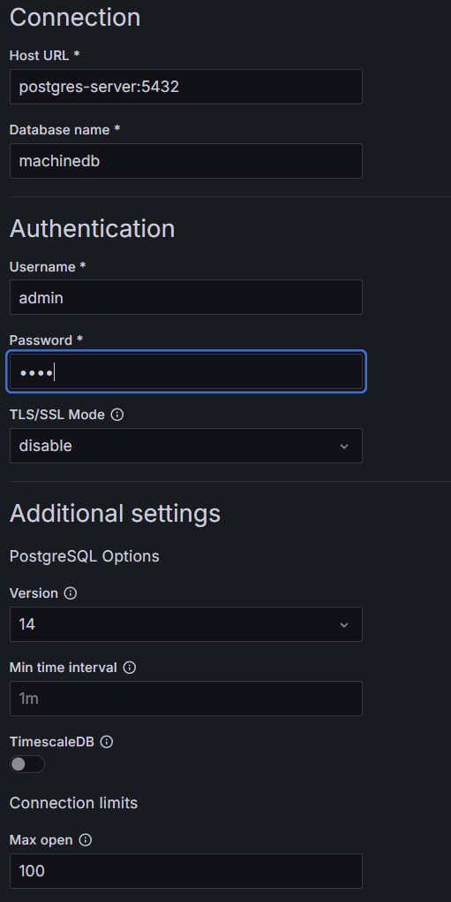
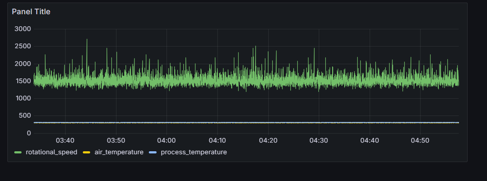
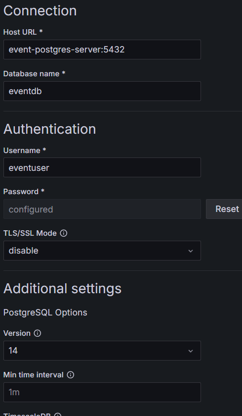
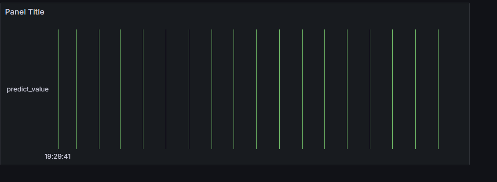

# Start Granfana and prometheus

```bash
$ docker compose -f grafana-docker-compose.yaml up -d
```

## Prometheus Connection Setting

- promethus.yml 설정
- Docker bridge 주소로 localhost에 접속
```bash
# promethus.yml
global:
  scrape_interval: 15s

scrape_configs:
  - job_name: 'fastapi'
    static_configs:
      - targets: ["172.17.0.1:8000"] 
```
### metric 수집 


## Source Postgres Connection Setting


### Source data


## Event Posgres Connection Setting


### Event Data
